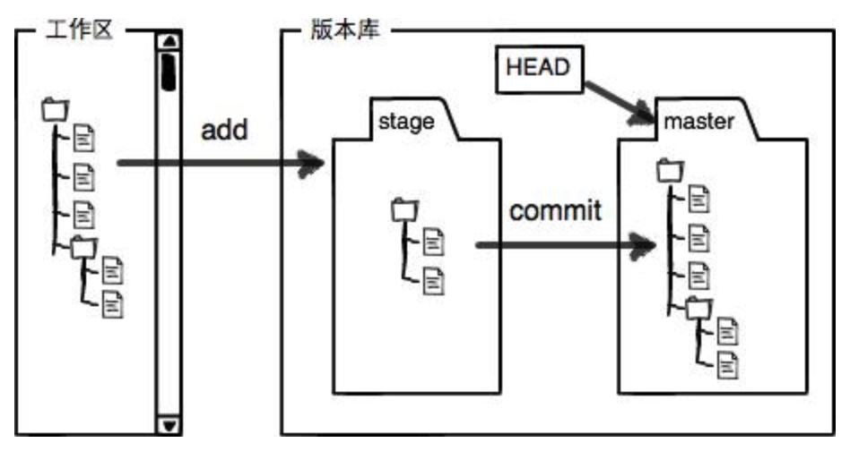

# Git
>1. [廖雪峰教程](https://www.liaoxuefeng.com/wiki/896043488029600/896067008724000 "git")
>2. [菜鸟教程](https://www.runoob.com/git/git-tutorial.html "git")
>3. [中文教程](http://gitbook.liuhui998.com/index.html "git")

## 一、安装与配置
+ `brew install git`	// mac安装
+ `git config --global user.name "YourName"`	// 配置用户姓名
+ `git config --global user.email "YourEmail"`	// 配置用户邮箱
+ `git config --list`	// 所有git配置信息
+ `vim .git/config`	// 项目下的git配置
+ `vim ~/.gitconfig`	// 用户下的git配置，使用--global
+ `vim /etc/gitconfig`	// 系统下的git配置，使用--system

## 二、创建仓库
+ `git init`	// 将当前目录变为git仓库
+ `git add (-f) FileName1 FileName2`	// 将文件添加至暂存区，-f表示强制
+ `git add .`	// 添加当前目录下所有文件至暂存区
+ `git add DirectoryName`	// 将指定目录添加至暂存区，包括子目录
+ `git commit -m "Description"`	// 将暂存区文件添加至仓库，同时添加描述信息

## 三、查看状态
+ `git status (-s)`	// 当前仓库状态，-s表示简洁显示
+ `git diff FileName`	// 查看暂存区与工作区的差异
+ `git diff --cached FileName`	// 查看暂存区与仓库的差异
+ `git diff HEAD FileName`	// 查看所有差异

## 四、版本回退
+ `git log (--graph --pretty=oneline --abbrev-commit)`	// 查看提交日志
+ `git log -1(-2 -3...)`	// 查看最近提交
+ `git reset --hard HEAD^`	// 将暂存区与工作区都回退至上个版本，HEAD/HEAD\~0代表当前版本，HEAD^/HEAD\~1为上个，依此类推
+ `git reset --hard CommitId`	// 回到指定版本
+ `git reflog`	// 查看之前命令

## 五、工作区和暂存区

## 六、管理修改
+ `git reset HEAD FileName`	// 重置暂存区与当前版本一致，工作区不变==取消暂存
+ `git restore FileName`	// 撤销工作区的改动
+ `git restore --staged FileName`	// 取消暂存，回退到工作区
+ `git rm FileName`	// 删除版本库文件
+ `git rm --cached FileName`	// 取消暂存

## 七、远程仓库
+ `ssh-keygen -t rsa -C "YourEmail"`	// ~/.ssh中的id_rsa.pub添加至github，-t为指定密钥类型，-C为注释
+ `git remote add origin git@github.com:Llizzzc/RepositoryName.git`	// 关联远程库
+ `git push (-u) origin main`	// 提交至远程库，-u代表首次提交
+ `git remote -v`	// 查看远程库信息
+ `git remote rm origin`	// 断开远程库连接
+ `git clone git@github.com:Llizzzc/RepositoryName.git`	// 从远程库克隆

## 八、分支管理
+ `git branch BranchName`	// 创建分支
+ `git switch BranchName`	// 切换分支 
+ `git checkout BranchName`	// 切换分支
+ `git switch -c BranchName`	// 创建并切换分支
+ `git checkout -b BranchName`	// 创建并切换分支
+ `git branch`	// 查看分支
+ `git branch -d(-D) BranchName`	// 删除分支，-D为强制
+ `git merge BranchName`	// 合并分支至当前分支
+ `git merge --no-ff -m "Description" BranchName`	// 删除分支依然保留分支信息
+ `git branch -M OldName NewName`	// 重命名分支
+ `git stash`	// 储存当前工作区
+ `git stash list`	// 查看存储的工作区
+ `git stash pop stash@{Num}`	// 恢复工作区同时删除stash内容
+ `git stash apply stash@{Num}`	// 恢复工作区
+ `git stash drop stash@{Num}`	// 删除stash内容
+ `git cherry-pick CommitId`	// 复制指定提交到当前分支
+ `git switch -c BranchName origin/BranchName`	// 创建关联远程分支的本地分支
+ `git checkout -b BranchName origin/BranchName`	// 创建关联远程分支的本地分支
+ `git branch --set-upstream-to=origin/BranchName BranchName`	// 本地分支关联远程分支
+ `git pull`	// 抓取远端最新分支
+ `git rebase`	// [rebase](http://gitbook.liuhui998.com/4_2.html "rebase")

## 九、标签管理
+ `git tag`	// 查看标签
+ `git tag TagName` // 默认给最新的提交打标签
+ `git tag TagName CommitId` // 给指定提交打标签
+ `git tag -a TagName -m "Description" CommitId`	// 带说明的标签
+ `git show TagName`	// 查看标签详情
+ `git tag -d TagName`	// 删除标签
+ `git push origin TagName(--tags)`	// 将标签推送到远程库，--tags代表所有
+ `git push origin :refs/tags/TagName`	// 从远程库删除标签

## 十、自定义
+ `touch .gitignore`	// 忽略特殊文件[configfiles](https://github.com/github/gitignore "configfiles")
+ `git check-ignore -v FileName`	// 检查.gitignore规则
+ `!FileName`	// 不忽略某个文件
+ `git config --global alias.OldName NewName`	// 重命名命令