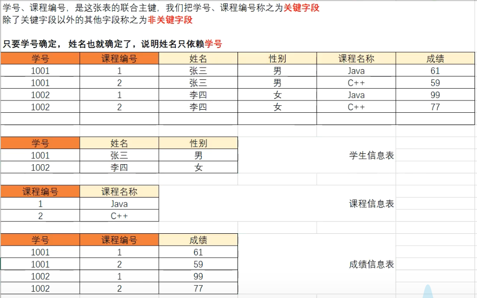

# Mysql
>1. [配置Mysql](https://blog.csdn.net/tyt_XiaoTao/article/details/80664740 "mysql")
>2. [千峰教育Mysql](https://www.bilibili.com/video/BV1qb4y1Y722?p=29&spm_id_from=pageDriver "mysql")

## 一、基本概念
1. 关系型数据库，采用关系模型来组织数据存储，以行和列形式存储数据并记录数据与数据之间的关系（将数据存储在表格），可以通过建立表格与表格之间的关联来维护数据与数据之间的关系。
2. 非关系型数据库，采用键值对模型来存储数据，只完成数据的记录，不回记录数据与数据之前的关系。

## 二、用户管理
+ `mysql (-h Ip) -u UserName -p`	// 登录mysql，-h远程连接，/etc/mysql/mysql.conf.d/mysqld.cnf(注释bind-address=127.0.0.1)，重启ubuntu
+ `quit;`	// 退出mysql
+ `SHOW tables;`	// 显示该数据库所有表
+ `CREATE USER 'UserName'@'Ip' IDENTIFIED BY 'Password';`	// 新增用户，Ip指定用户可以在哪个地址登陆，localhost为本地，%为任何地址
+ `RENAME USER 'OldName'@'Ip' TO 'NewName'@'Ip';`	// 修改用户名
+ `ALTER USER 'UserName'@'Ip' IDENTIFIED BY 'Password';`	// 用户改密
+ `DROP USER 'UserName'@'Ip';`	// 删除用户
+ `SHOW grants;`	// 查看当前用户权限
+ `SHOW grants FOR 'UserName'@'Ip';`	// 查看某用户权限
+ `GRANT Privileges ON DataBase.TableName TO 'UserName'@'Ip' (IDENTIFIED BY 'Password') (WITH GRANT OPTION);`	// 赋予权限，添加密码表示创建并赋予权限
+ `REVOKE Privileges ON DataBase.TableName FROM 'UserName'@'Ip';`	// 删除权限
+ `FLUSH PRIVILEGES;`	// 刷新权限

|权限|权限说明|权限级别|
|:--|:--|:--|
|CREATE|创建数据库、表或索引|数据库、表或索引|
|DROP|删除数据库或表|数据库或表|
|GRANT OPTION|赋予权限选项|数据库或表|
|REFERENCES|引用|数据库或表|
|ALTER|更改表|数据表|
|DELETE|删除表数据|数据表|
|INDEX|操作索引|数据表|
|INSERT|添加表数据|数据表|
|SELECT|查询表数|数据表|
|UPDATE|更新表数据|数据表|
|CREATE VIEW|创建视图|视图|
|SHOW VIEW|查看视图|视图|
|ALTER ROUTINE|更改存储过程|存储过程|
|CREATE ROUTINE|创建存储过程|存储过程|
|EXECUTE|执行存储过程|存储过程|
|FILE|服务器主机文件的访问|文件管理|
|CREATE TEMPORARY TABLES|创建临时表|服务器管理|
|LOCK TABLES|锁表|服务器管理|
|CREATE USER|创建用户|服务器管理|
|RELOAD|执行 flush privileges, refresh, reload 等命令|服务器管理|
|PROCESS|查看进程|服务器管理|
|REPLICATION CLIENT|查看主从服务器状态|服务器管理|
|REPLICATION SLAVE|主从复制|服务器管理|
|SHOW DATABASES	|查看数据库|服务器管理|
|SHUTDOWN	|关闭数据库|服务器管理|
|SUPER|超级权限	|服务器管理|
|ALL|所有||
|USAGE|什么都无||

## 三、SQL语句分类
### 1.DDL：数据定义语言

####  1.1数据库操作

+ `create database (if not exists) dbName (character set Encoding);`	// 创建数据库，可以指定字符编码
+ `show databases;`	// 显示所有数据库
+ `show create database dbName;`	// 显示指定数据库的SQL创建语句
+ `alter database dbName character set Encoding;`	 // 修改数据库字符编码
+ `drop database (if exists) dbName;`	// 删除数据库
+ `use dbName;`	// 切换数据库

#### 1.2表操作

+ 
    ```sql
    create table tbName(
     Term1 Type1 Limits,
     Term2	Type2 Limits,
     primary key(Term1, Term2)	// 该方式可以定义联合主键
     constraint fkName foreign key(Term) references tbName(Term)	// 定义外键
    );	// 创建表
    ```
+ `show tables;`	// 显示当前数据库中的表
+ `desc tbName;`	// 显示某表结构
+ `drop table (if exists) tbName;`	// 删除表
+ `alter table tbName rename to NewName;`	// 修改表名
+ `alter table tbName character set Encoding;`	// 修改表字符编码，默认和数据库一致
+ `alter table tbName add Term Type Limit;`	// 添加字段
+ `alter table tbName change Term NewName Type Limits;`	// 修改字段名和类型，Limits中的非空约束会重置为允许null，主键约束会变成唯一约束，最好一起更改
+ `alter table tbName modify Term Type Limits;`	// 只修改字段类型
+ `alter table tbName drop Term;`	// 删除字段
+ `alter table tbName drop primary key;`	// 删除表主键约束
+ `alter table tbName drop foreign key fkName;`	// 删除外键约束
+ `alter table add constraint fkName foreign key(Term) references tbName(Term) ON UPDATE CASCADE ON DELETE CASCADE;`	// 级联修改和删除，更新被引用表的被引用字段，引用表的引用字段也会同步更新

#### 1.3数据类型

+ 数值类型
  |tinyint|smallint|mediumint|int/integer|bigint|float|double|decimal|
  |:-:|:-:|:-:|:-:|:-:|:-:|:-:|:-:|
  |1byte|2byte|3byte|4byte|8byte|4byte|8byte|限定|
  
+ 字符类型
	|char|varchar|tinyblob|blob|mediumblob|longblob|tinytext|text|mediumtext|longtext|
  |:-:|:-:|:-:|:-:|:-:|:-:|:-:|:-:|:-:|:-:|
  |0~255byte不可变长|0~65535byte可变长度|0~255byte|0~65535byte|||0~255byte可变长度|0~65535byte|||
+ 日期类型
  |date|time|year|datetime|timestamp|
  |:--:|:--:|:--:|:--:|:-:-|
  |2021-09-13|12:12:33|2021|2021-09-13 12:12:33|20210913 121233|

#### 1.4字段约束

+ 非空约束(not null)：必须提供值
+ 唯一约束(unique)：此字段值不能重复
+ 主键约束(primary key)：非空且唯一，每个表中最多只能有一个主键，自增`auto_increment`，联合主键是将表的多个字段一起设置为表的主键
+ 外健约束(foreign key)：建立不同表之间的关联

### 2.DML：数据操作语言

#### 2.1插入语句
+ `insert into tbName(Term1, Term2) values('', '');`	// 要保持前后对应
#### 2.2删除语句
+ `delete from tbName where Condition;`	// 没有where则删除表中所有数据
#### 2.3修改语句
+ `update tbName set Term1='', Term2='' where Condition;`	// 没有where则会修改一整列

### 3.DQL：数据查询语言

#### 3.1单表查询
+ `select Term1, Term2 from tbName where Condition;`	// 用and、or来支持多条件，用not来取反，条件有=、!=、>、<、>=、<=、between n1 and n2、like 'reg'(%表示任意多个字符，_为占位符)
+ `select Term from tbName where Condition order by Term1 asc|desc, Term2 asc|desc; `	// 结果按字段排序，默认升序，可以先满足第一个规则再加其他规则
+ `select Term as NewName from tbName;`	// 处理结果，可以给字段取别名
+ `select distinct Term from tbName;`	// 处理结果，消除重复
+ `select count(Term) from tbName where Condition;`	// 统计字段数
+ `select max|min(Term) from tbName where Condition;`	// 指定字段最大值或最小值
+ `select sum(Term) from tbName where Condition;`	// 查询指定字段数据总和
+ `select avg(Term) from tbName where Condition;`	// 查询指定字段数据平均值
+ `now()|sysdate();`	// 当前系统时间，向datetime字段添加数据可以使用字符串，也可以使用now()和sysdate()
+ `select upper|lower(Term) from tbName;`	// 将指定字段的值转换大小写
+ `select substring(Term, Start, Len) from tbName;`	// 截取字段的值，Start从1开始
+ `select concat(Term1, '-', Term2) from tbName;`	// 拼接字段
+ `select Term, Function(Term) from tbName group by Term having Condition;`	// 按字段分组，返回每个分组的第一个值，可以加上聚合函数一起使用，可加having对结果进行筛选
+ `slect ... from ... where ... limit (PageNum - 1)*PageSize, PageSize;`	// 查询第n页数据

#### 3.2多表查询
+ 一对一：通过主键关联，即两张数据表中主键相同的数据为相互对应的数据；也可以通过唯一外键关联，即在任意一张表中添加一个字段设置为外键约束与另一张表的主键关联，同时设置唯一约束
+ 一对多与多对一：在多端添加外键与一端的主键关联
+ 多对多：创建一个关系表，在表中设置两个外键分别关联两张表的主键
+ `select ... from tbName1 inner join tbName2 on Condition;`	// 内连接，生成两张表的笛卡尔积，有很多无用信息，因此要加上匹配条件，可以在表名后加空格取别名简化操作
+ `select ... from tbName1 left join tbName2 on Condition;`	// 左连接，显示tbName1中的所有数据，如果在tbName2中存在与前表满足匹配的数据，则一起显示，否则显示为null
+ `select ... from tbName1 right join tbName2 on Condition;`	// 与左连接相反
+ `select ... from tbName where Term=(select ...);`	// 嵌套查询，将子查询的结果作为父查询的条件，如果子查询返回多个结果，使用in

### 4.DCL：数据控制语言

## 四、存储过程

### 1.概念

+ 能够将完成特定功能的SQL指令进行封装(SQL指令集)，编译之后存储在数据库服务器上，并为其去一个名字，客户端就可以通过名字来直接调用这个SQL指令集，获取执行结果
### 2.优缺点
#### 2.1优点
+ SQL指令无需客户端编写，通过网络传送，可以节省网络开销，同时避免SQL指令在网络传输过程中被恶意篡改
+ 存储过程经过编译创建并保存在数据库中，执行过程无需重复的进行编译操作，对SQL指令的执行过程进行了性能提升
+ 存储过程中多个SQL指令之间存在逻辑关系，支持流程控制语句，可以实现更为复杂的业务
#### 2.2缺点
+ 存储过程是根据不同的数据库进行编译、创建并存储在数据库中，当我们需要切换到其它数据库产品时，需要重新编写存储过程
+ 存储过程受限于数据库产品，如果需要性能优化会成为一个问题
+ 在互联网产品中，如果需要数据库的高并发访问，使用存储过程会增加数据库的连接执行时间，因为我们把复杂的业务交给了数据库处理
### 3.使用
#### 3.1存储过程管理
存储过程是属于某个数据库的，只能在当前数据库调用存储过程
+ ```sql
	create procedure prcName(in Arg1 Type, in Arg2 Type, out Arg3 Type)
	begin
		SQL...;
	end;	// 创建
	set Arg3 = 0;	// 赋值
	call Name(Arg1, Arg2, Arg3);	// 调用
	select Arg3 from dual;	// 查看变量
	```
+ `show procedure status where db='dbName;`	// 查看某数据库的存储过程
+ `show create procedure dbName.prcName;`	// 查看存储过程创建细节
+ `alter procedure prcName Property;`	// 修改存储过程特征
	+ CONTAINS SQL	// 包含SQL语句，但不包含读写语句
	+ NO SQL	// 不包含SQL语句
	+ READS SQL DATA	// 包含读语句
	+ MODIFIES SQL DATA	// 包含写语句
	+ SQL SECURITY (DEFINER INVOKER)	// 指明定义者还是调用者可执行
	+ COMMENT 'descript'	// 注释
+ `drop procedure prcName;`	// 删除
#### 3.2变量
+ `declare Arg Type (default Value);`	// 定义局部变量
+ `set @Arg=Value;`	// 定义全局变量，变量名以@开头，在dual中查找
+ `select count(Term) into Arg from tbName;`	// 将查询结果赋值给变量
#### 3.3参数
+ `in`	// 输入，传递数据给存储过程的参数
+ `out`	// 返回值
+ `inout`	// 可以当输入也可以当返回值
#### 3.4流程控制
+ ```sql
	if Condition then
		SQL...;
	else
		SQL...;
	end if;
	```
+ ```sql
	case a
	when 1 then
		SQL...;
	when 2 then
		SQL...;
	else
		SQL...;
	end case;
	```
+ ```sql
	while Condition do
		SQL...;
	end while;
	```
+ ```sql
	repeat
		SQL...;
	until Condition
	end repeat;
	```
+ ```sql
	LoopName loop
		SQL...;
		if Condition then
			leave LoopName;
		end if;
	end loop;
	```
### 4.游标
+ 游标可以用来依次取出查询结果集中的每一条数据
+ `declare cursName cursor for select ...;`	// 声明游标
+ `open cursName;`	// 打开游标
+ `fetch cursName into Agr1, Agr2...;`	// 提取游标当前指向的数据，游标自动下移
+ `close cursName;`	// 关闭游标

## 五、触发器
### 1.概念
+ 特殊的存储过程，但是触发器无需调用，执行DML操作时会自动触发执行，无需手动调用，可以使用NEW和OLD关键字在触发器中获取触发这个触发器的DML操作的数据
### 2.优缺点
#### 2.1优点
+ 触发器是自动执行的
+ 可以实现表中数据的关联操作，有利于保证数据的完整性
+ 可以对DML操作的数据进行更为复杂的合法性校验
#### 2.2缺点
+ 使用触发器实现的业务逻辑如果出现错误将难以定位，后期维护困难
+ 大量使用触发器易造成代码结构杂乱，增加程序的复杂性
+ 当触发器操作的数据量比较大时，执行效率会大大降低
+ 互联网项目中应避免使用触发器，对于并发量不大的项目可以使用存储过程，但是不提倡
### 3.使用
+ ```sql
	create trigger triName	// 创建
	before|after
	insert|delete|update
	on tbName
	for each row	// 操作几条记录就触发几次
	SQl...;
	```
+ `show triggers;`	// 查看触发器
+ `drop trigger triName;`	// 删除
+ NEW：用于获取`insert`操作添加的数据、`update`操作修改后的数据
+ OLD：用于获取`delete`操作删除前的数据、`update`操作修改前的数据
## 六、视图
### 1.概念
+ 由数据中一张表或多张表根据特定的条件查询出的数据构成的虚拟表
### 2.作用
+ 安全性：如果我们直接将数据表授权给用户操作，那么用户可以CRUD任何数据，假如我们想要对数据表中的部分数据进行保护，可以将公开的数据生成为视图，授权用户访问视图
+ 简单性：如果我们需要查询的数据来源于多张表，可以使用多表连查，我们通过视图将这些连查的结果对用户开放，用户则可以通过视图获取多表数据
### 3.使用
+ ```sql
	create view viName	// 创建
	AS
	select ... from ...;
	```
+ `select * from viName;`	// 从视图查询数据
+ `desc viName;`	// 查询视图结构
+ `create or replace view viName as select...;`	// 修改视图
+ `alter view viName as select...;`	// 修改
+ `drop view viName;`	// 删除，不会影响原数据表中的数据
### 4.特性
+ 查询操作：如果在数据表中添加了新的数据，而且这个数据满足创建视图时查询语句的条件，通过查询视图也可以查询出新增的数据，当删除原表中满足查询条件的数据时，也会从视图中删除
+ 增加操作：如果在视图中添加数据，数据会被添加到原数据表
+ 删除操作：如果在视图中删除数据，数据也会从原表删除
+ 修改操作：如果在视图中修改数据，也会修改原数据表的数据
## 七、索引
### 1.概念
+ 将数据表中的某一列或者某几列的值取出来构造成便于查找的结构进行存储，生成数据表的目录。当我们进行数据查询的时候，则先在目录中进行查找得到对应数据的地址，然后再到数据表中根据地址快速获得数据记录，避免全表扫描
### 2.优缺点
#### 2.1优点
+ 索引大大降低了数据库服务器在执行查询操作时扫描的数据
+ 索引可以避免服务器排序，将随机IO变成顺序IO
#### 2.2缺点
+ 索引是根据数据表字段创建的，当数据表中数据发生DML操作时，索引需要更新
+ 索引文件也会占用磁盘空间
### 3.分类
+ 主键索引：在数据表的主键字段创建的索引，声明为主键时自动创建
+ 唯一索引：在数据表的唯一字段创建的索引，声明唯一约束时自动创建，可自行创建
+ 普通索引：普通字段上创建的索引
+ 组合索引：两个及以上字段联合起来创建的索引
### 4.使用
+ `show indexs|keys from tbName;`	// 查询数据表索引
+ `create (unique) index indexName on tbName(Term1, Term2);`	// 创建索引
+ `drop index indexName on tbName;`	// 删除表索引
## 八、事务
### 1.概念
+ 完成同一个业务的多个DML操作
### 2.特性
+ 原子性(Atomicity)：一个事务中的多个DML操作，要么同时执行成功，要么同时执行失败
+ 一致性(Consistency)：事务执行前后，数据库中的数据是一致的，完整性和一致性不能被破坏
+ 隔离性(Isolation)：多个并行的事务之间不能相互影响
+ 持久性(Durability)：事务完成之后，对数据的操作是永久的
### 3.事务管理
+ 在MySQL中，默认的DML指令是自动提交的，当我们执行一个DML指令后，自动同步到数据库中
+ 手动提交需要执行`start transaction;`开启事务，如果事务执行过程中出现异常，使用`rollback;`来撤销操作，否则使用`commit;`来进行提交
### 4.事务隔离级别
+ 读未提交(read uncommitted)：事务2可以读取事务1执行但未提交的数据，可能会导致脏读(读取未提交数据)
+ 读已提交(read committed)：事务2只能读取事务1已提交的数据，避免了脏读，可能会导致虚读(在同一个事务中，两次查询操作读取到的数据不一样)
+ 可重复读(repeatable read)：事务2第一次查询之后，在其结束之前其它事务不能修改对应的数据，避免了虚读，但可能导致幻读(事务2对数据表的数据进行修改然后查询，在查询之前事务1向数据表新增了一条数据，就导致事务2以为修改了所有数据，但却查询出了与修改不一致的数据)
+ 串型化(serializable)：同时只允许一个事务对数据表进行操作，避免了脏读、虚读、幻读问题
### 5.设置隔离级别
+ `select @@tx|transaction_isolation;`	// 查看隔离级别，默认为第三级
+ `set session transaction isolation level Rank;`	// 设置隔离级别
## 九、数据库设计流程

1. 根据应用系统的功能，分析数据实体
	+ 电商系统：商品、用户、订单...
	+ 管理系统：学生、课程、成绩...

2. 提取实体的数据项
	+ 商品：名称、图片、描述...
	+ 用户：姓名、密码...
	
3. 检查数据项是否满足三范式
	+ 不满足三范式可以会导致数据的冗余，造成维护困难
	
	+ 一范式：要求数据表的字段不可再分
	
	+ 二范式：不存在非关键字段对关键字段的部分以依赖
	  
	
	+ 三范式：不存在非关键字段之间的传递依赖
		
	
4. 绘制E-R图

5. 数据库建模
	+ 三线图进行表设计
	+ PowerDesigner
	+ PDMan
	
6. 建库建表

7. 数据测试